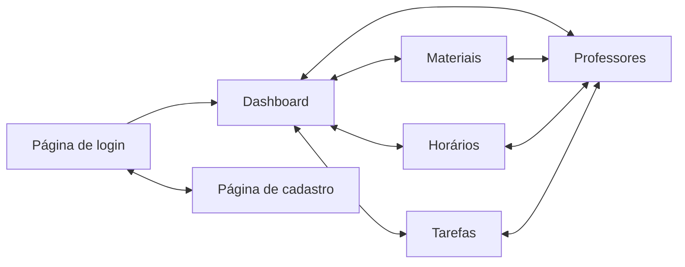

# AbstractSingletonProxyFactoryBean

Aplicação para guardar informações relevantes das salas de 3° e 4° semestre de ciências da computação

## Front-end

### Tecnologias

- React
- TailwindCSS

### Fluxo



### Diagrama de classes

```mermaid
erDiagram


Task {
  UUID id
  VARCHAR title
  TEXT description
  VARCHAR attachments
  TEACHER teacher
}

Teacher {
  UUID id
  VARCHAR name
  VARCHAR imageUrl
}

Class {
  UUID id
  VARCHAR name
  VARCHAR schedule
  VARCHAR weekDay
  TEACHER teacher
}

Resource {
  UUID id
  VARCHAR name
  VARCHAR url
  CLASS class
}

Notice {
  UUID id
  VARCHAR title
  TEXT text
}

Resource }|--|| Class : has_many
Task ||--|| Teacher : has
Class ||--|| Teacher : has

```
