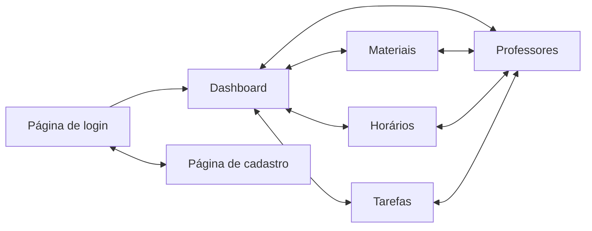

# UNIP

Aplicação para guardar informações relevantes das salas de 3° e 4° semestre de ciências da computação

## Front-end

### Tecnologias

- React
- TailwindCSS

### Fluxo

```mermaid
flowchart LR
A[Página de login] --> B[Dashboard]
A <-->  C[Página de cadastro]
B <--> D[Materiais]
B <--> E[Tarefas]
B <--> F[Professores]
B <--> G[Horários]
D <--> F
G <--> F
E <--> F
```
